# Daily Bugle  

  - [Task 1](#task-1-deploy)
  - [Task 2](#task-2-obtain-user-and-root)

## Task 1 Deploy

### 1: Reconnaissance
  First, I start by checking which ports are open and which services are running. To do so we will use [nmap](https://nmap.org/).  
  Using the nmap, command `nmap -A -T4 MACHINE_IP`, I got to know there are three ports and services running on them are stated.

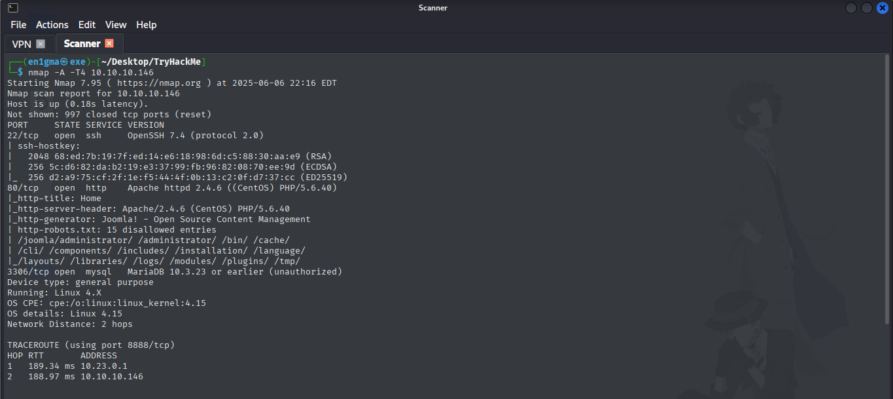

  Since, the apache server is running at the port 80 ,so, I accessed the web page, then I looked into the source code for any clue and I found the name of the robber. i.e. `spiderman`. Looking the main page, I found this post telling `Spider-Man robs bank!`, thus we got our first awnser.. 

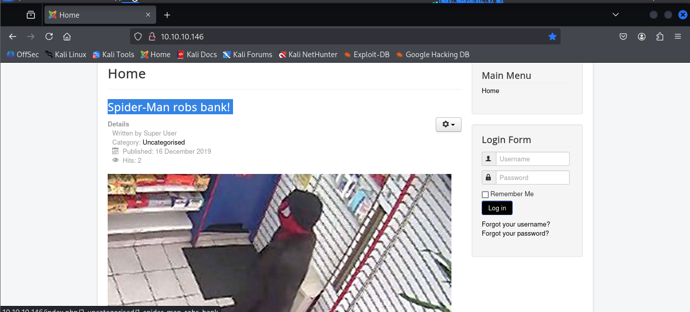

## Task 2 Obtain user and root

  We can use [gobuster](https://github.com/OJ/gobuster) or [ffuf](https://github.com/ffuf/ffuf) to search for hidden directories. By using the `-u` flag we can specify a url to attack. As a wordlist we will can use the [`common.txt`](https://github.com/danielmiessler/SecLists/blob/master/Discovery/Web-Content/common.txt), [`rockyou.txt`](https://github.com/brannondorsey/naive-hashcat/releases/download/data/rockyou.txt) or any of [`seclist`](https://github.com/danielmiessler/SecLists/tree/master/Discovery/Web-Content) wordlist.

The command: will look like  `gobuster dir -u http://MACHINE_IP -w /path/to/common.txt` for gobuster 
and for ffuf `ffuf -u http://MACHINE_IP/FUZZ -w /path/to/common.txt`                

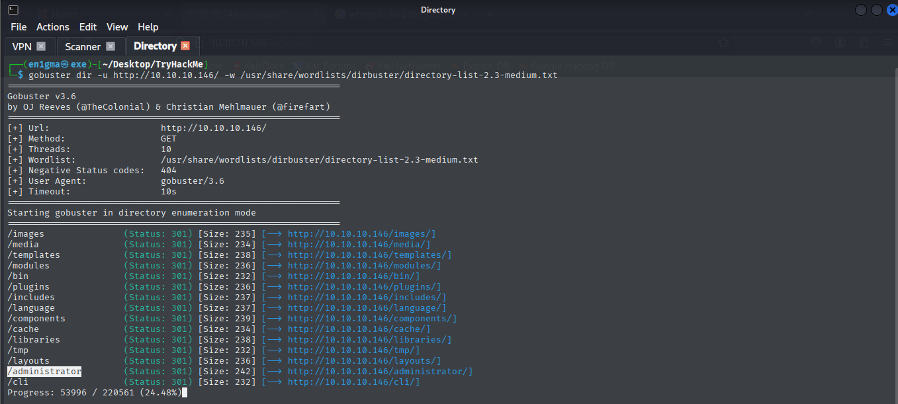

  Normally, the version is stored int the administrator directory, so, I vist the administrator but for this I need credentials to login and proceed. So, I start runnning a another directory search on the `/administrator` directory. 
The command: will look like  `gobuster dir -u http://MACHINE_IP/administrator -w /path/to/Discovery/Web-Content/combined_words.txt` for gobuster  
and for ffuf `ffuf -u http://MACHINE_IP/administrator/FUZZ -w /path/to/Discovery/Web-Content/combined_words.txt`                

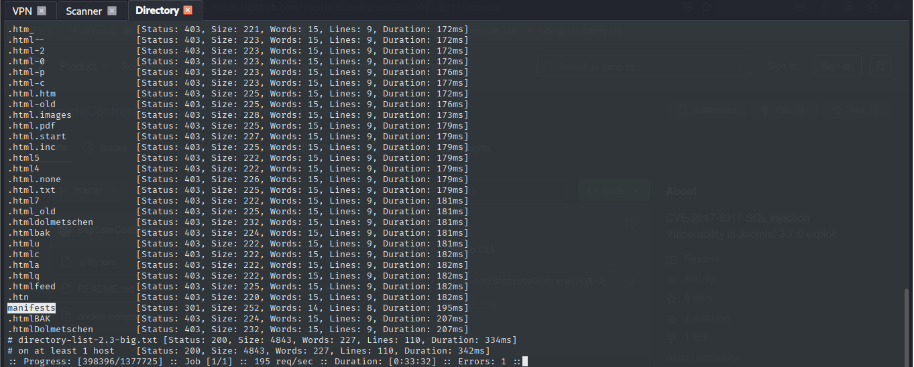

  There I found `manifests` and `include` which are potential directories to store the the version. But visiting `include`, I could not found the version or any thing. But visiting `manifests`, I found some more directories.

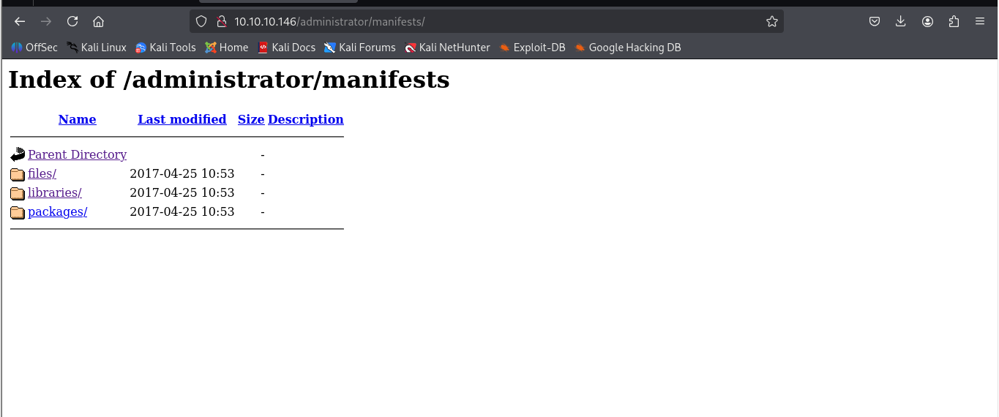

  But only `files` was something intresting containting the `joomla.xml`, where I found the version of the joomla.

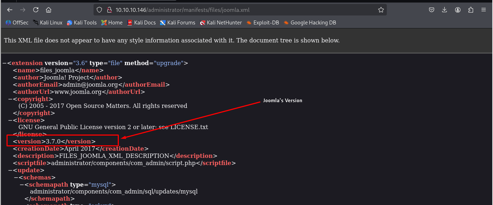  

 

### 2: Exploitation

  After this, I tried to find the vulnerability of specific version and found this blog where, I got to know the actual vulnerability and discover the `CVE` of the vulnerability [🔗 Blog](https://www.acunetix.com/vulnerabilities/web/joomla-core-3-7-0-sql-injection-3-7-0/)

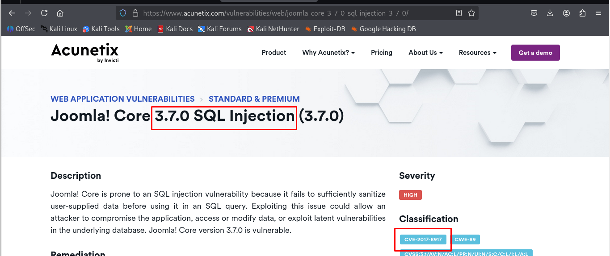

  After this I try to find the exploit for the `CVE-2017-8917`.  After consulting many websites, I found the gihub exploit using which I got myself username and a hash.   
  
  *Unfortunately I missed to take note of the link to the github exploit so I am uploading the exploit script on my github* i.e. [CVE-2017-8917-Sqli's Exploit](https://github.com/en1gm4-exe/TryHackMe/blob/main/Daily%20Bugle/CVE-2017-8917-Sqli.py)

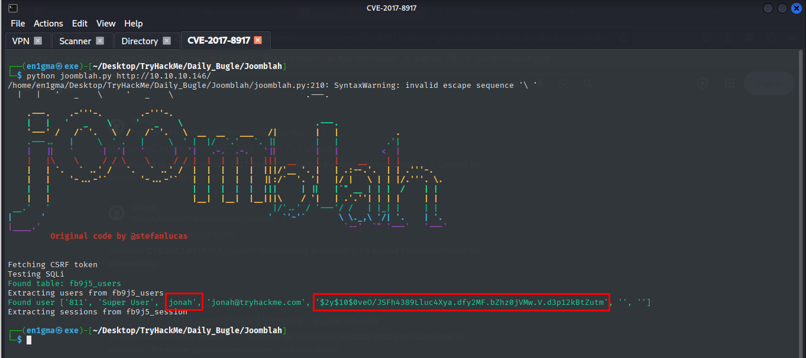  
  
  So, I saved the hash to the file and I attempted to crack it using the tool `John the ripper`. And after sometime I got the password to login to the admin portal, I found earlier.
  
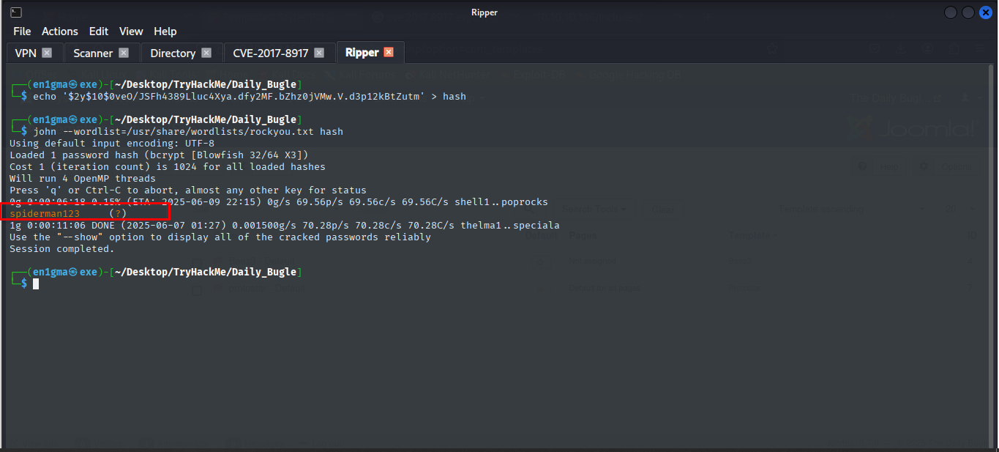 

### 3: Initial Access
  After getting the password and the username, I accessed the admin portal at `http://<TARGET_IP>/administrator/` with credentials:
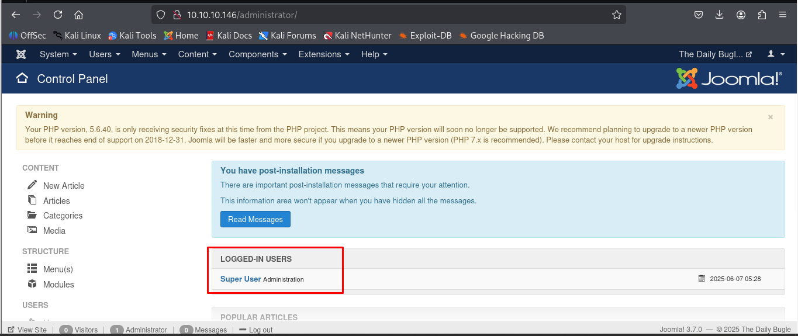   

  After this I tried searching for any directory where I could find any uploading portal. In one of the directory I found the uploading portal so I attempt uploading test files but it didn't allowed me to save the file. So, I again start exploring the pages and directories... 
  
  
   After sometime, I found the `template` directory where I found files realted to configurations. And it also allow me uploading files. 
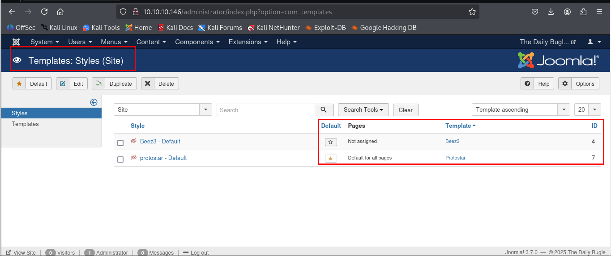

  So, I generated the reverse shell using the shell [generator](https://www.revshells.com/) and setting up `ip` and `port` in it, saved the shell into the file named [shell.php](https://github.com/en1gm4-exe/TryHackMe/blob/main/Daily%20Bugle/shell.php) uploaded in this repo. 
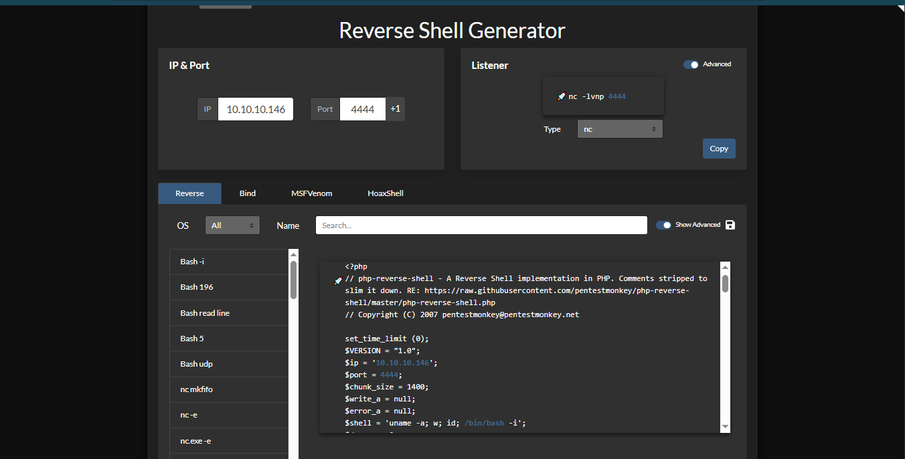   

  Then, I tried to upload the `shell.php` in the `joomla` folder..

  But unfortunately, It showed me the error for file uploading, then again I start exploring the files and I found, a official document of `joomla` which tells about the editing the files and making changes in them. So, I tried to edit files. and then I selected the `error.php` where I would be saving my reverse shell. 
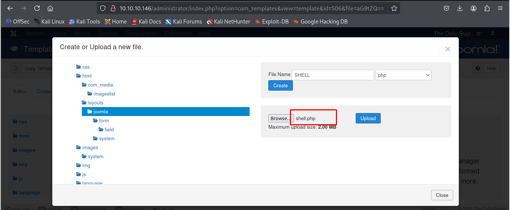   

  After replacing the `error.php` with my reverse shell, I saved the `error.php` and it was saved succesfully.
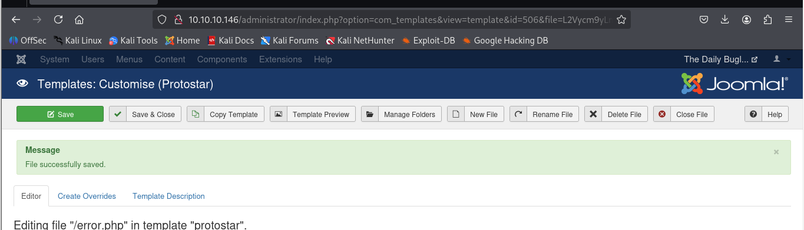     

  After this, I started the netcat listener on the `port` I added in the reverse shell. i.e. 

<pre>
  nc -lvnp 4444
</pre> 

I visited the the link 
<pre>http://10.10.10.146/templates/protostar/error.php</pre>
to trigger the reverse shell and we successfully got the shell in the listner, as the username `apache`.... 
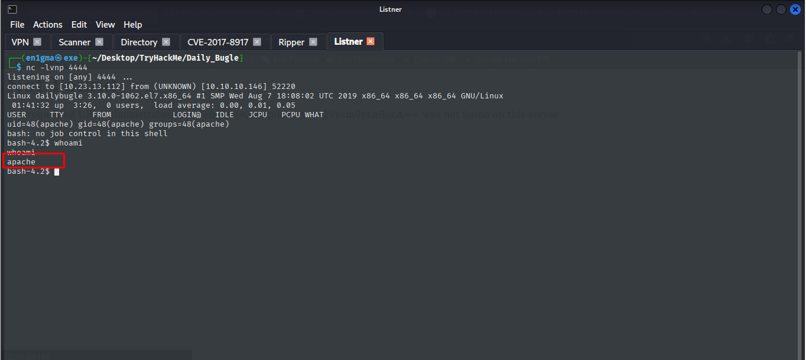     

  After I try to find the user flag in the home directory, and there was only one user at home i.e. `jjameson` but I couldn't access the home of that user.
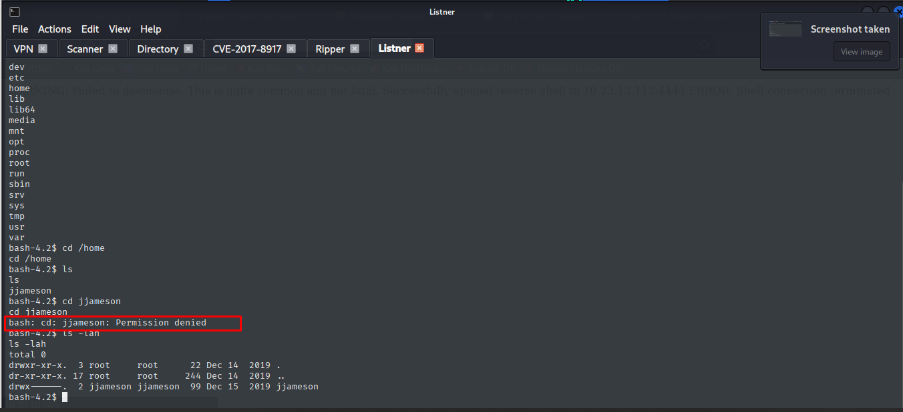  

## 4: Privilege Escalation
## I - Lateral Movement
  After this I started exploring the files and directories thinking there might be any clue about the user's access. And after sometime, I statred exploring the configuration files and in the html and apache configuration files I looked into a `configuration.php` where I found the `user`, `password` and a `secret` named string. 
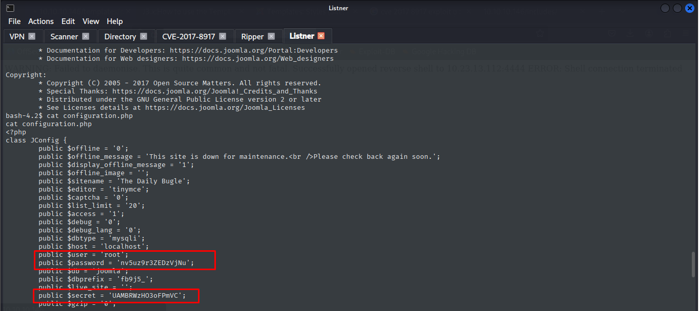  

  Beside this I didn't find anything related to login. So, I went to give this password and secret a attempt as my password for that user. 
And to my suprise I was able to login into ssh shell using this password as password for `jjameson`.
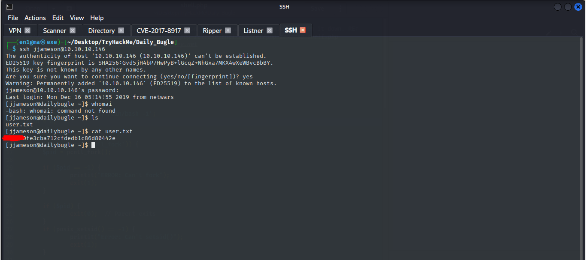  
  And that's how I was ablt to get the user flag present in the `user.txt` present in `home`.

  

## II - Root Escalation
  Now, it's time for root flag, firstly i tried to find the `sudo` privilege given to user `jjameson`.  
    Using the command 
    <pre> sudo -l </pre>
  I got to know, `jjameson` have sudo privileges for the command-line package utility named `yum` 
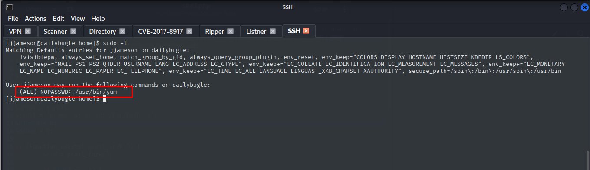  

  So, using this information, I tried to find as if I could escalate the privileges using the `yum`, For this , I looked into the [GTFOBins](https://gtfobins.github.io/gtfobins/yum/) exploits, and I found my desired exploit for privilege escalation to `root`. 
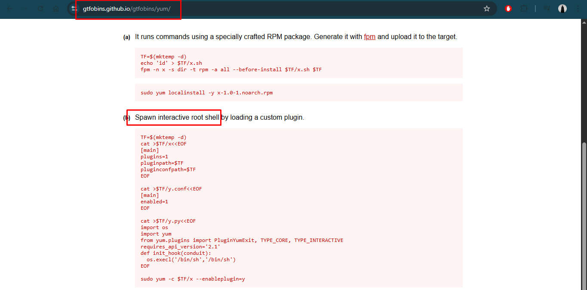

  After this I just copied the exploit techniques and pasted into the shell, due to which I got the privileges for the `root` and getting shell as the `root`, I was able to retrieve the `root` flag, present in the `/root/root.txt` file
 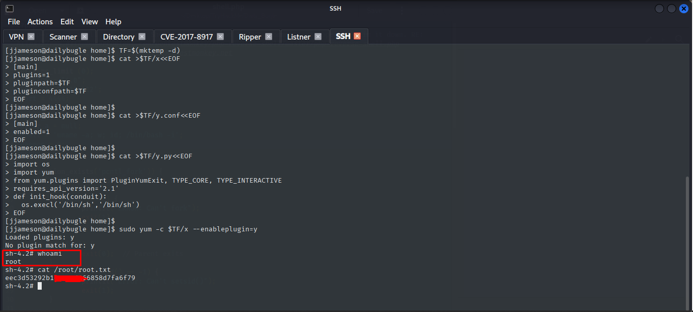 
