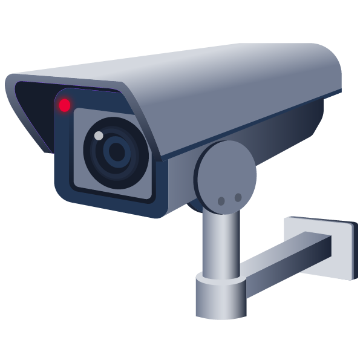

  
# Security Footage 
  <i>Perform digital forensics on a network capture to recover footage from a camera.</i>  
  
  [Link](https://tryhackme.com/room/securityfootage)

  

## Task 
<a>Someone broke into our office last night, but they destroyed the hard drives with the security footage. Can you recover the footage? </a>
 
 

<a>We are given a `PCAP` file for forensics. i.e. [PCAP](https://github.com/en1gm4-exe/TryHackMe/blob/main/Security%20Footage/security-footage.pcap) 

<a>First I opened the `.pcap` file in the [wireshark](https://www.wireshark.org/download.html) And I started inspecting the packets. First packet was TCP hand shake intializer, `TCP SYN` packet... </a>   

<a> Second packet is `TCP ACK` in the hand shake... </a>

<a> Third packet shows the successful `TCP` hand shake... </a>

<a> Forth packet shows the `HTTP GET` request from the attacker... </a>

<a>After packet there is no more http protocol packet, so this means rest of the packets are the data tranfer to the attacker after that http request. </a>

<a>So, I followed the TCP Stream to have a better look at sequential communication or packet transfer.  To open the stream,  
- Right Click on any packet
- Then, hover the pointer on `Follow`
- Click on the `TCP Stream`  

Or  alternatively you can press `ctrl+alt+shift+T`  </a>

 
 

<a>Once we are in the tcp stream tab, we can notice that there is only one stream in all and on the left side, there is `1 turn` between client and server, so whole communication started after that one `HTTP GET` message.</a>

<a>So, let's take a look on the stream..</a>

<a> By setting the filter `show as` of the wireshark to `ASCII` , we can see the packet and we can identify the things happening in it.
So, at top we have `HTTP GET` and then we got `200 OK` as server response to the request and the dat tranfer is done in the images as `Content-type` parameter shows the file type is images with extension of `JPEG`.
</a>

 
 

<a> So, I used my python based tool to extract the data from the `.pcap`.  
Tool's walkthrough is present on the tool's repo i.e. [PCAP_Extractor](https://github.com/en1gm4-exe?tab=repositories), for instance using cli version of my tool, I extracted the `JPEG` files using the command  
`python3 PCAP_Extractor.py security-footage-1648933966395.pcap -o Flag --jpg`
<i>`-o` is used to name the output directory and `--jpg` is used to tell the tool to scan for jpg files only, since jpg and jpeg are interchangeable extensions. </i>

<a>We succesfully extracted the data from the `.pcap` and looking into the output director, I found the flag is separated in pixels so seeing the image in flow will help to get the flag. </a>

<a>By looking all the `541` images one by one, we can retrieve the flag. </a>

## Flag 🚩
<i> This room is not much complex, so you must try to do it by your own way to retrieve the flag..</i>

